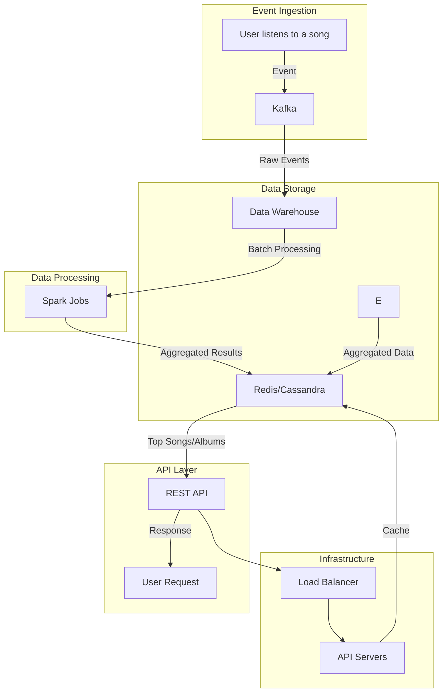

```mermaid
graph TD;
    subgraph Event Ingestion
        A[User listens to a song] -->|Event| B[Kafka]
    end
    subgraph Data Storage
        B -->|Raw Events| C[Data Warehouse]
        E -->|Aggregated Data| F[Redis/Cassandra]
    end
    subgraph Data Processing
        C -->|Batch Processing| D[Spark Jobs]
        D -->|Aggregated Results| F
    end
    subgraph API Layer
        F -->|Top Songs/Albums| G[REST API]
        G -->|Response| H[User Request]
    end
    subgraph Infrastructure
        G --> I[Load Balancer]
        I --> J[API Servers]
        J -->|Cache| F
    end
```