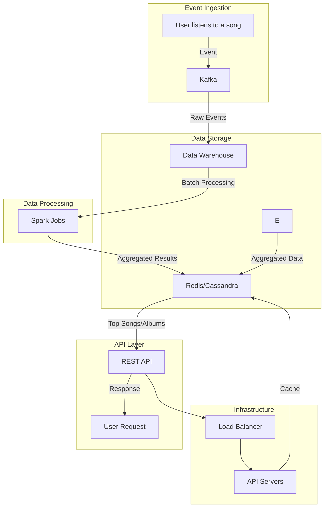
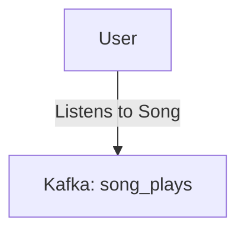
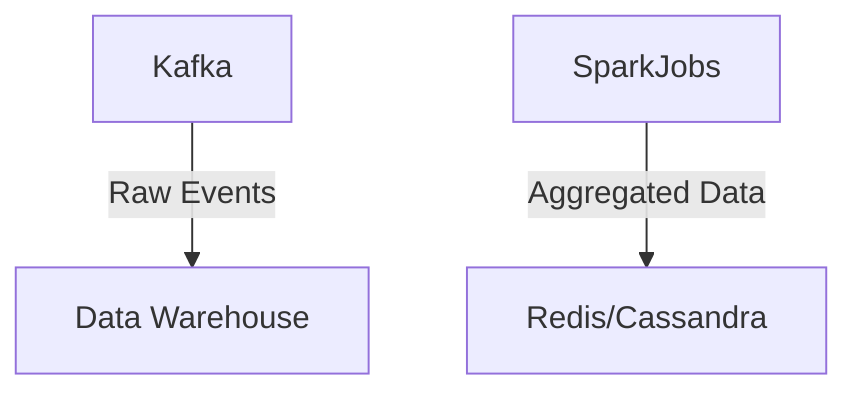
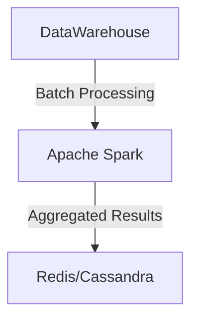
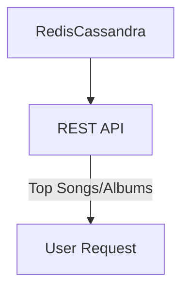
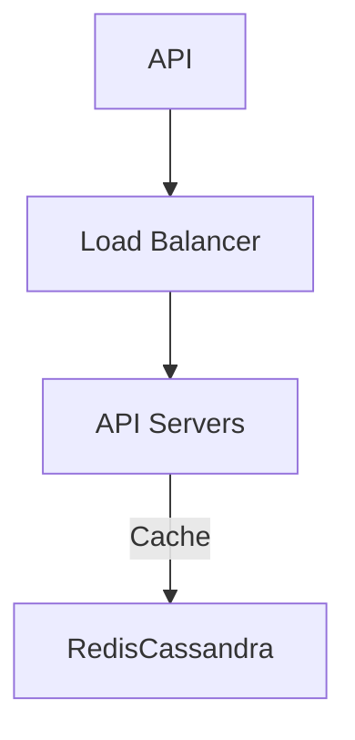
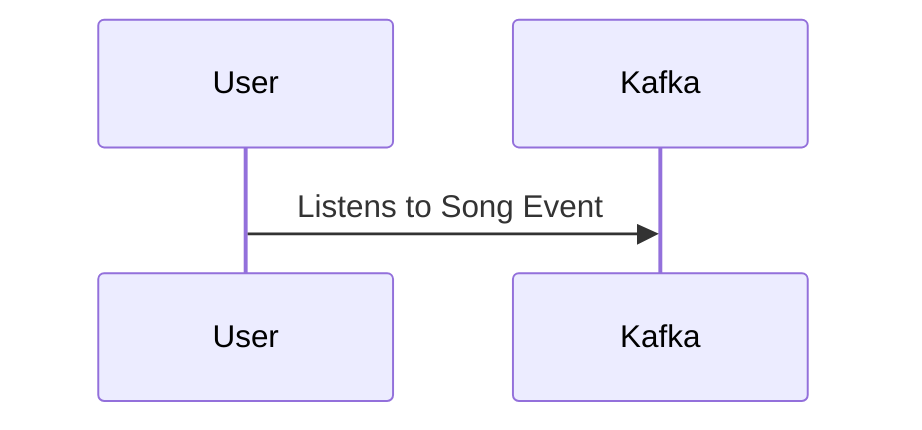
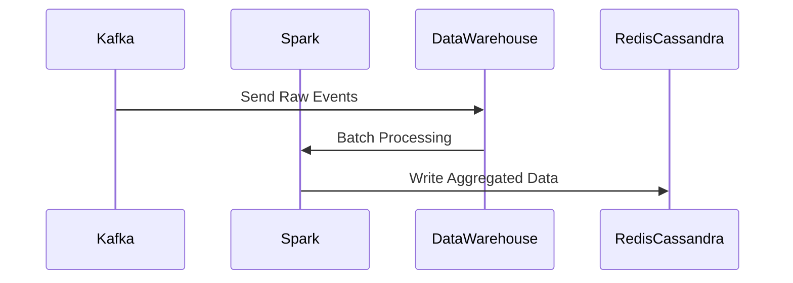
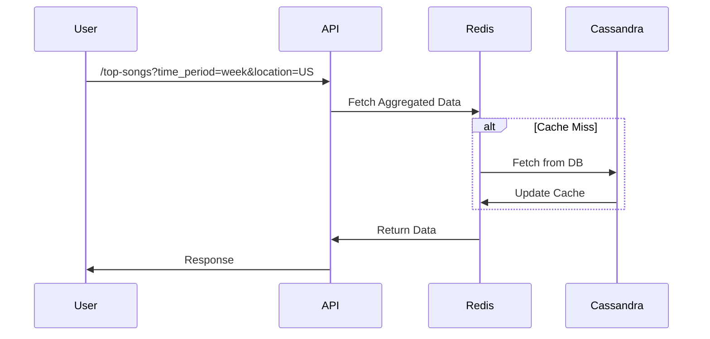

### Solution Overview

#### Components:
1. **Event Ingestion**: Ingest song listening events using Kafka.
2. **Data Storage**: Store raw events in a data warehouse and aggregated data in Redis/Cassandra.
3. **Data Processing**: Aggregate data using batch processing with Apache Spark.
4. **API Layer**: Serve top songs/albums through a REST API.
5. **Infrastructure**: Deploy on a cloud platform with auto-scaling and load balancing.

### Architecture Diagram

### Detailed Design

#### 1. Event Ingestion

- **Kafka Topics**: 
  - `song_plays`: For raw events.
  - `aggregated_events`: For aggregated data.

#### 2. Data Storage

- **Data Warehouse**: Store raw events.
- **Redis/Cassandra**: Store aggregated data.

#### 3. Data Processing

- **Batch Processing**: Use Apache Spark for aggregation.

#### 4. API Layer

- **REST API**: Serve top songs/albums.
- **Caching**: Use Redis for caching responses.

#### 5. Infrastructure

- **Cloud Deployment**: Use auto-scaling and load balancing.

### Data Flow Example

1. **User Listens to a Song**:
    - Event generated: `{user_id, song_id, timestamp, location}`
    - Event sent to Kafka topic `song_plays`.

2. **Batch Processing**:
    - Spark job reads from `song_plays`.
    - Aggregates data and writes to Redis/Cassandra.

3. **API Request**:
    - User requests `/top-songs?time_period=week&location=US`.
    - API server retrieves data from Redis.
    - If cache miss, fetch from Cassandra, update cache, and respond.

### Conclusion

By following this architecture, we ensure that the system is scalable and capable of handling high throughput while providing low-latency responses. Using Kafka for event ingestion, Spark for batch processing, and Redis/Cassandra for data storage and caching, we can efficiently manage and serve the top songs and albums across different time periods and locations.